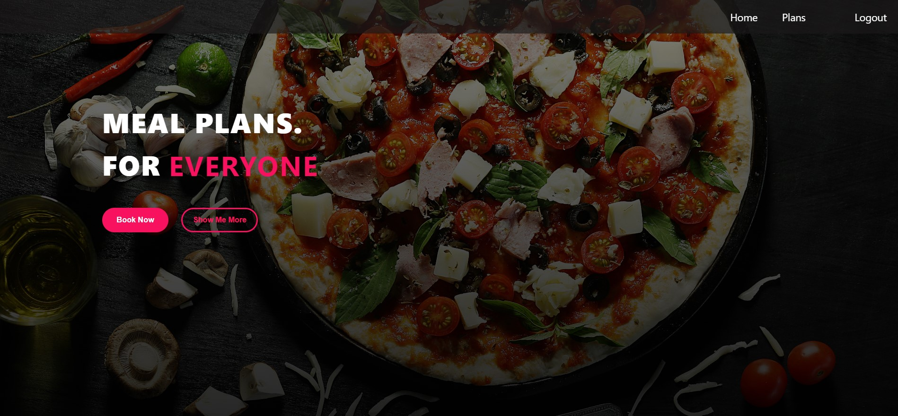
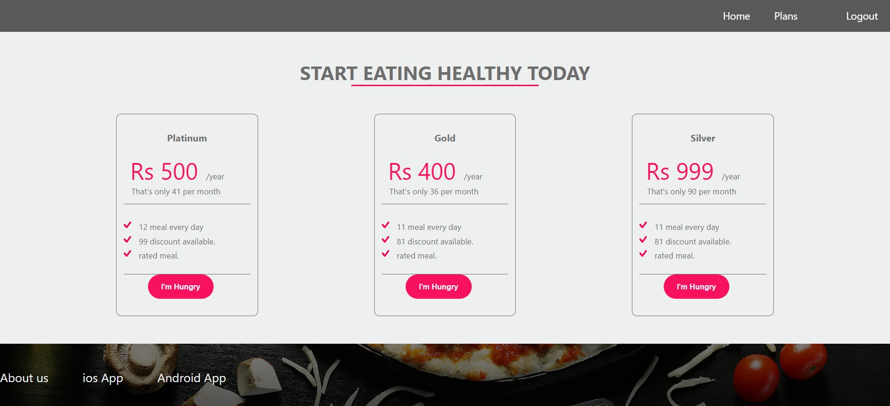
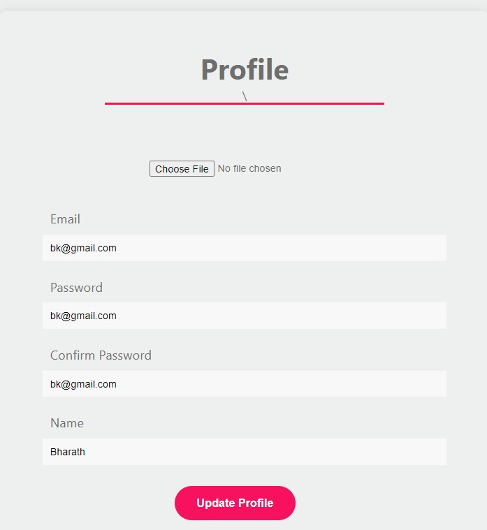

<h1 align="center">Hi 👋, Welcome to Food App </a></h1>
<h3 align="center">An E-Commerce website built using MERN Stack.</h3>

<h2> </h2>
       

 
        <h2> Tech Stack: </h2> 
        
        
        
        
        <h2 align="left">Tools: </h2>
 

 
 

        
        
        
        
        
        
 

 
        
        <h2 align="left">Languages: </h2>
        
        <h2> </h2>      

       <h2 align="left">Architecture: </h2>  
        
        <h2 align="left">Restful Api: </h2>  
             

<h2> </h2>

       <h2 align="left">Result: </h2>
       <h3>Home Page: </h3>
        
        <h3> Plans Page: </h3>
        
        <h3> Profile Page: </h3>
        
        

